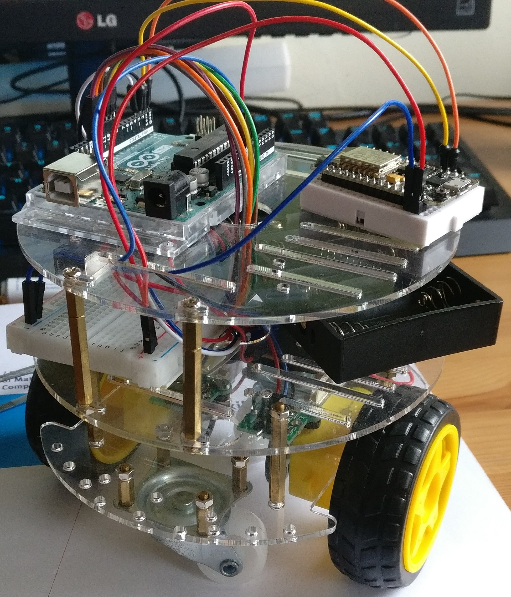
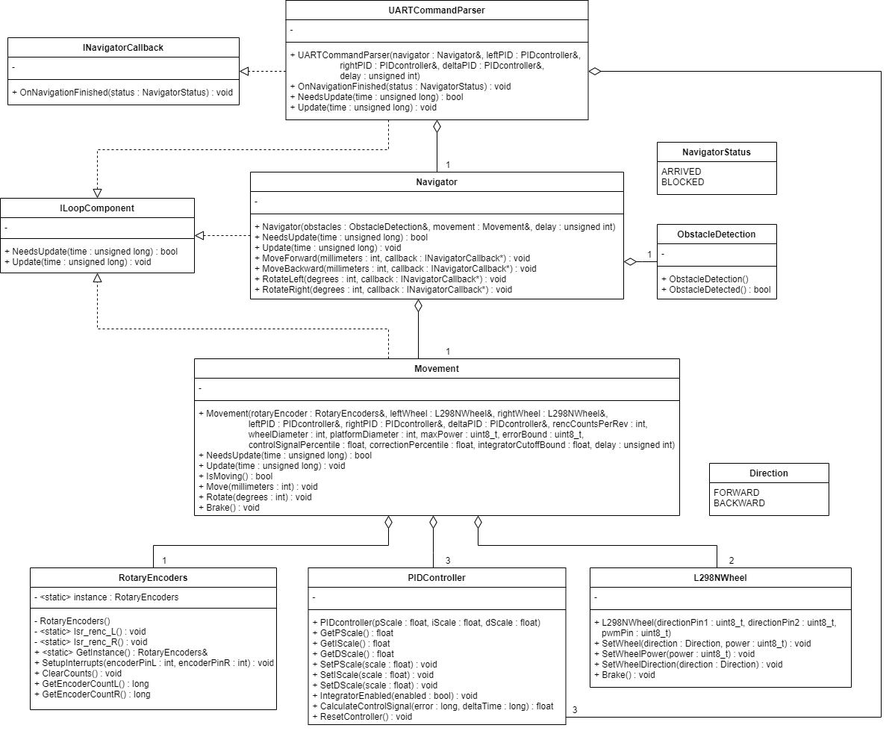

# PIDbot
PIDbot is a 2-wheeled robot which makes use of multiple PID-controllers to be able to drive around with precision. The main intent of this project was to demonstrate the usage of PID-controllers in a tangible way that highlights their usefulness and versatility.

## Parts list
The robot was assembled using the following parts:
* [L298N motor driver](https://www.tinytronics.nl/shop/nl/robotica/motoren/motoraansturingen/l298n-bipolaire-stappenmotor-en-dc-motor-motoraansturing) x1
* [Circular robot kit from TinyTronics](https://www.tinytronics.nl/shop/nl/robotica/auto-kit-zelfbouw-rond) x2
* [Dc motor with 120:1 gearbox fomr TinyTronics](https://www.tinytronics.nl/shop/nl/robotica/reservemotor-auto-kit-zelfbouw-120:1) x2
* [B83609 Optical encoder](https://www.dx.com/p/hc-020k-double-speed-measuring-module-w-photoelectric-encoders-black-green-2-pcs-2027855.html) x2
* [400 point breadboard](https://www.tinytronics.nl/shop/nl/prototyping/breadboards/breadboard-400-points) x1
* [8x AA battery holder from TinyTronics](https://www.tinytronics.nl/shop/nl/batterij-en-accu/batterijhouders/8x-aa-batterij-houder-met-losse-draden) x1
* [8x eneloop 1.2v 750mAh AAA batteries](https://www.tinytronics.nl/shop/nl/batterij-en-accu/aaa/eneloop-oplaadbare-batterij-4x-aaa-750mah)
* 2.3 nanofarad capacitor x2 (though something similar to that range will probably also work)
* Arduino Uno mounting plate (optional but quite helpful)

(Note, you might need to use some bearings when mounting the motors to the chassis to get the right fitting, else the rotary encoders might not fit properly)

---

## Powering the robot
During this project the robot was mainly powered via 8 rechargable 1.2v 750mAh AAA batteries. Connected in series these gave 9.6v and 750mAh. When using a different power setup the following 2 points must be kept in mind:

The L298N motor driver is a very old model which is designed for much higher current. Because of this the L298N driver has a voltage drop of about 2.0v.

Currently, the code controlling the motordriver has a hardcoded motor speed to prevent
saturating and damaging the dc motors. When the voltage of the power source is change this speed must be changed manually to prevent damaging the motors.

An alternative to this setup would be to use a LiPo battery, which is able to supply the required current with a much lower voltage.

---

## Usage
The robot receives instructions via serial communication using the `Tx` and `Rx` pins. If an unknown command is given to the robot or the command was malformed during transit. The robot will send back a `NAVF\n` token via serial.

Commands have the following structure:  
`[COMMAND] [ARGUMENT]\n`  
The command and its argument are separated by a space character, The instructions themselves are separated by newline characters. The newline character is used to signify the end of a message.

Currently the robot has 4 movement commands:

#### FORN
Usage: `FORN [distance in millimeters]\n`  
Tells the robot to move forward a specified distance in millimeters. Once the robot has moved said distance it will send back a `NAVS\n` token via serial.

#### BACN
Usage: `BACN [distance in millimeters]\n`  
Tells the robot to move backward a specified distance in millimeters. Once the robot has moved said distance it will send back a `NAVS\n` token via serial.

#### TULN
Usage: `TULN [rotation in degrees]\n`  
Tells the robot to rotate a specified amount of degrees counter-clockwise. Once the robot has rotated said degrees it will send back a `NAVS\n` token via serial.

#### TURN
Usage: `TURN [rotation in degrees]\n`  
Tells the robot to rotate a specified amount of degrees clockwise. Once the robot has rotated said degrees it will send back a `NAVS\n` token via serial.

The robot also has some additional commands for setting the different scalers for the used PID-controllers. These can be used as followed:

### SETMTRVARP
Usage: `SETMTRVARP [new scaler value]\n`  
Sets the `P` values for the 2 PID-controllers that control the motors. Once the robot has set the value it will send back a `VARSETS\n` token via serial.

### SETMTRVARI
Usage: `SETMTRVARI [new scaler value]\n`  
Sets the `I` values for the 2 PID-controllers that control the motors. Once the robot has set the value it will send back a `VARSETS\n` token via serial.

### SETMTRVARD
Usage: `SETMTRVARD [new scaler value]\n`  
Sets the `D` values for the 2 PID-controllers that control the motors. Once the robot has set the value it will send back a `VARSETS\n` token via serial.

### SETDLTVARP
Usage: `SETDLTVARP [new scaler value]\n`  
Sets the `P` value for the PID-controller that corrects the error-delta between the motors. Once the robot has set the value it will send back a `VARSETS\n` token via serial.

### SETDLTVARI
Usage: `SETDLTVARI [new scaler value]\n`  
Sets the `I` value for the PID-controller that corrects the error-delta between the motors. Once the robot has set the value it will send back a `VARSETS\n` token via serial.

### SETDLTVARD
Usage: `SETDLTVARD [new scaler value]\n`  
Sets the `D` value for the PID-controller that corrects the error-delta between the motors. Once the robot has set the value it will send back a `VARSETS\n` token via serial.

### PRINTPIDVARS
Usage: `PRINTPIDVARS\n`  
Prints out the current PID-controller values.

---

## Class diagram

---

## PID-controller structure

The robot uses a PID-controlled closed loop to allow it to drive around with (a reasonable amount of) precision. This closed loop consists of 2 PID-controllers and 1 PD-controller in total. The 2 PID-controllers are used to control the individual wheel motors, the PD-controller is used for minimizing the delta in the current error between the 2 wheels and will add an additional correction signal to the total control signal.

To prevent exceeding the motor's maximum the 2 controller outputs are clamped to a percentage. This means that the final control signal output is composed of for example: 80% PID-controller signal and 20% PD-controller correction.

The PID-controllers themselves are comprised of a P, I and D controller with accompanying scalers.  
Before the control signal is fed into the dc motor is it first clamped by a saturation clamp in the closed loop. This clamp is to prevent the motor from receiving a control signal which exceeds the motors maximum power.

Additionally, an integrator cutoff switch is build-in to prevent [integral windup](https://en.wikipedia.org/wiki/Integral_windup). This switch is controlled by the Integrator cutoff comparator in the closed-loop by comparing the non-clamped and clamped output of the control signal.

---

## Further tweaking
the `constants.h` header file inside of the `include` folder contains all settings-variables used throughout the robot. It is a good place to start when trying to optimize the robots performance.

---

## Todo
- [x] implement new design from class diagram  
- [x] add PID controller to robot  
- [x] create a static private method for calculating circumference in `movement.cpp`  
- [x] replace macros in `main.cpp` with constants in header file  
- [ ] add unit tests  
- [ ] create circuit diagram  
- [ ] replace power source with LiPo battery
